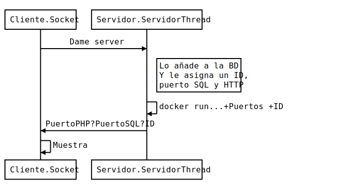
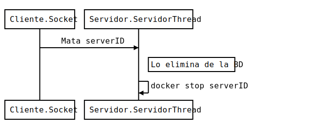
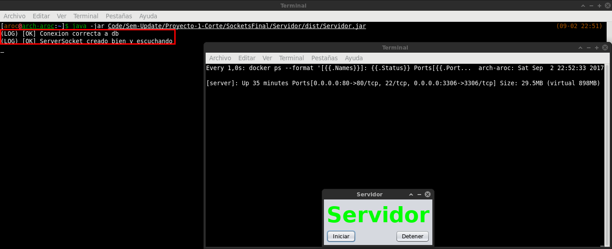
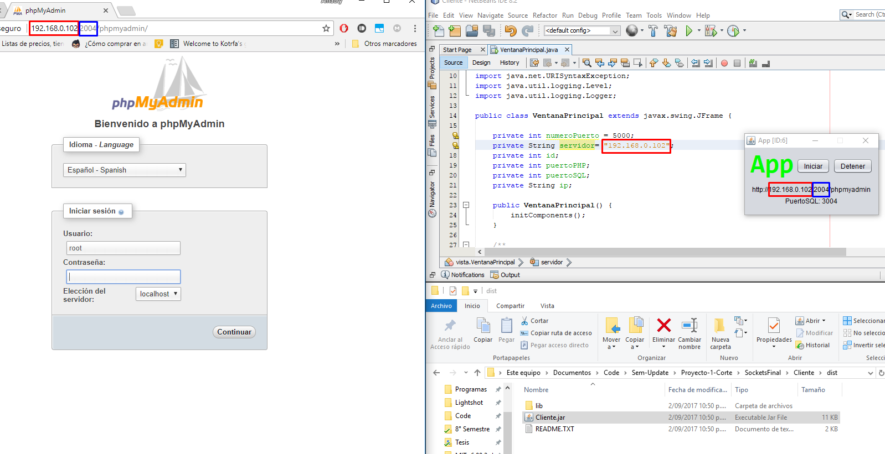
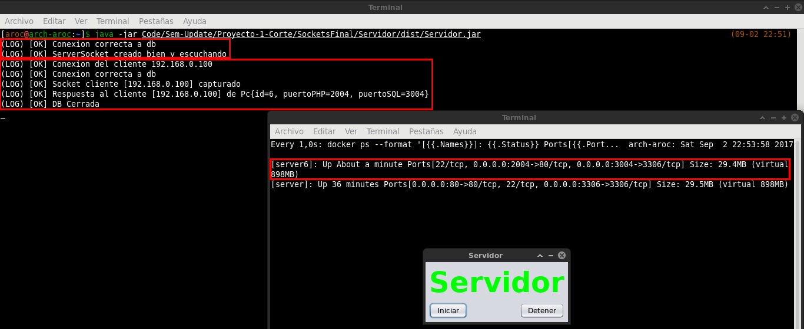
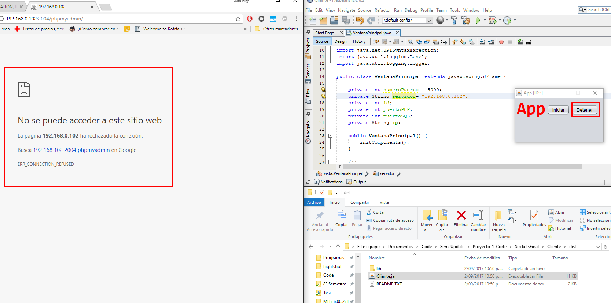
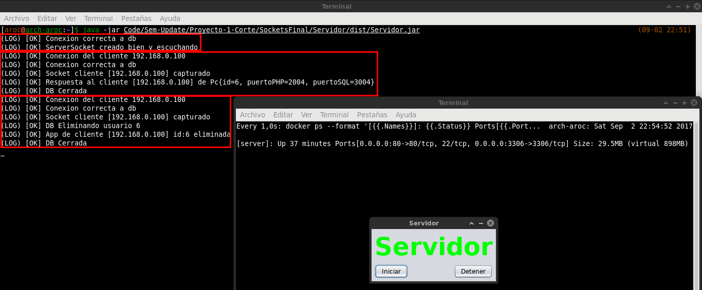
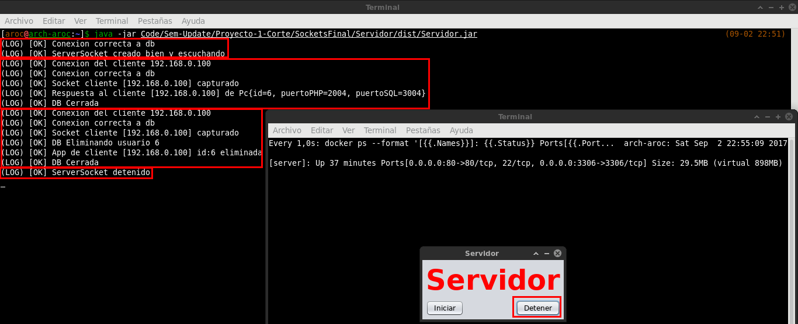

# Docker

## Creacion Dockerfile
Se uso como base la imagen `wnameless/mysql-phpmyadmin:latest` pero tenian que hacerse varios cambios, estos estan detallados [aqui](Docker/Docker.md), para crear el [Dockerfile](Docker/Dockerfile) de la imagen `xxdrackleroxx/test:latest`. Para facilitar la creacion de la imagen se hizo un [script](Docker/script.sh) en bash que llevan a cabo los cambios en el contenedor.

## Uso
Debido a que la aplicacion necesita una base de datos, usaremos la misma imagen docker `xxdrackleroxx/test:latest` para montar la base de datos que usara el servidor usando `docker run -d --rm -p 80:80 -p 3306:3306 --name=server xxdrackleroxx/test`. Para monitorear todos los contenedor de forma rapida se tiene el script [monitor.sh](Docker/monitor.sh). A partir de aqui se puede acceder a phpmyadmin por el puerto 80 para crear la base de datos `registro` y luego importar [registro.sql](../registro.sql).

## Comunicacion
[Como hacer diagramas de secuencia](https://bramp.github.io/js-sequence-diagrams/)

### Pidiendo servidor

<!---
```
Cliente.Socket->Servidor.ServidorThread: Dame server
Note right of Servidor.ServidorThread: Lo añade a la BD\nY le asigna un ID,\npuerto SQL y HTTP
Servidor.ServidorThread->Servidor.ServidorThread: docker run...+Puertos +ID
Servidor.ServidorThread->Cliente.Socket: PuertoPHP?PuertoSQL?ID
Cliente.Socket->Cliente.Socket: Muestra
```
--->

### Deteniendo servidor

<!---
```
Cliente.Socket->Servidor.ServidorThread: Mata serverID
Note right of Servidor.ServidorThread: Lo elimina de la BD
Servidor.ServidorThread->Servidor.ServidorThread: docker stop serverID
```
--->

## Demo
### Servidor 

### Cliente

### Servidor

### Cliente

### Servidor

### Servidor

