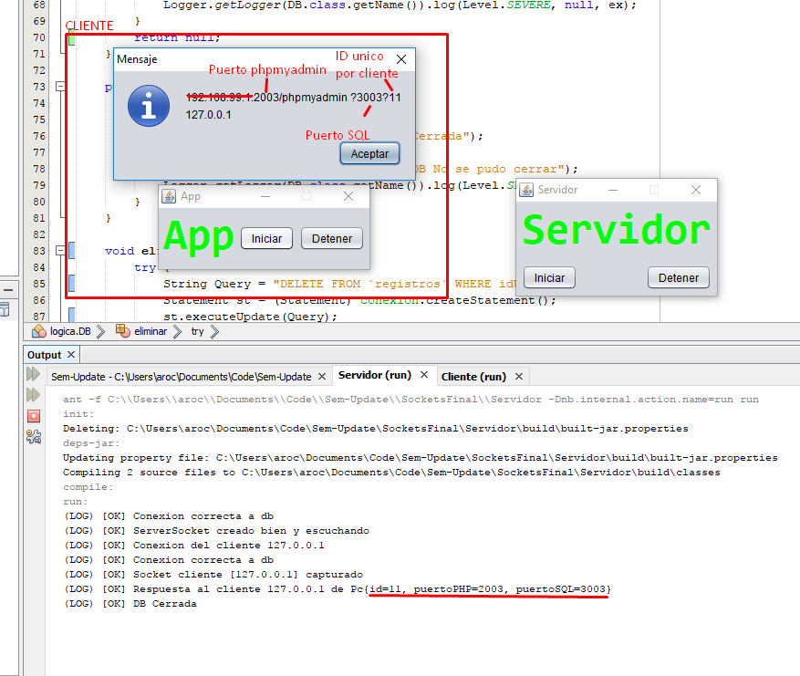
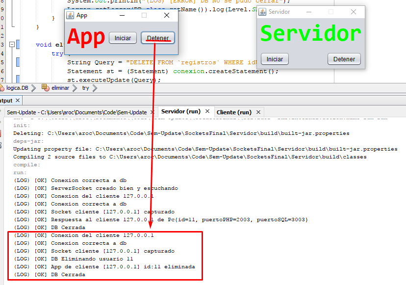

# Sem-Update
Repositorio para la asignatura Seminario de Actualización. 

## Contenido
  - [1 Corte](#1-corte)
    - [1.1 Sockets](#11-sockets)
    - [1.2 Sockets modificado](#12-sockets-con-modificaciones)
    - [1.3 RPC y RMI](#13-rpc-y-rmi)
    - [1.4 Proyecto final de corte](#14-proyecto-final-de-corte)
  - [Clases utiles]()
<!---  - [2 Corte](#2-corte)--->
<!---  - [3 Corte](#3-corte)--->

## 1 Corte

### 1.1 Sockets
Usando Socket y ServerSocket en java, un cliente intenta adivinar un numero aleatorio que esta almacenado en el servidor, tiene 10 intentos para adivinar el numero. [Codigo](1-Corte/Sockets/src/sockets)

### 1.2 Sockets con modificaciones
Usando la actividad [1.1](#11-sockets), hacer las siguientes actividades
- [ ] Tener UI en el cliente
- [ ] Apagar el servidor desde el cliente
- [ ] Usar hilos en el servidor para no quedar esperando readObject()
- [ ] Registre los computadores con su IP que se conectan. El cliente enciende su pc y enseguida se conecta al server
- [ ] Si un nuevo computador se conecta en horas picos (medio dia en adelante), debe apagarse enseguida
- [ ] Se debe mantener un registro de quien se conecta a que hora (BD)
- [ ] El cliente cuando se conecta, envia una instancia de objeto PC. Hay que crear la clase PC en un projecto java library y asi tener un .jar en el servidor y en el cliente

### 1.3 RPC y RMI
ToDo
[Link 1](https://www.adictosaltrabajo.com/tutoriales/rmi-remote-registry/)
[Link proyecto 1](http://omarghader.github.io/docker-tutorial-phpmyadmin-and-mysql-server/)
[Link proyecto 2](https://blog.thenets.org/how-to-install-mysql-and-phpmyadmin-with-docker/)

### 1.4 Proyecto final de corte
Usando sockets se tendra un servidor recibiendo peticiones de clientes para ofrecer un contenedor con phpmyadmin y mysql en 2 puertos unicos por cliente. [Codigo](Proyecto-1-Corte/)

Cuando el usuario pide el contenedor

Cuando el usuario pide detener el contenedor

To Do:
 - [ ] Crear propia imagen en docker basada en wnameless/mysql-phpmyadmin
 - [ ] Poner el comando de docker en el servidor
 - [ ] Recrear el proyecto con RMI

## Web services y RESTful
## SOAP
## Push. Google firebase

# Clases utiles
 - Thread, Task, Runnable, Process, Time
 - SocketChannel vs Socket en Java
 - JPA Framework para trabajar base de datos de forma abstracta
 - Derby en netbeans para hacer BD
 - Libreria hyperic/sigar en github
 - Active record
 - WebRTC

# Proyecto
- **Articulo** Final de curso. Estudio comparativo RPC, RMI, SOCKET, MQTT
- Informe tecnico del proyecto
